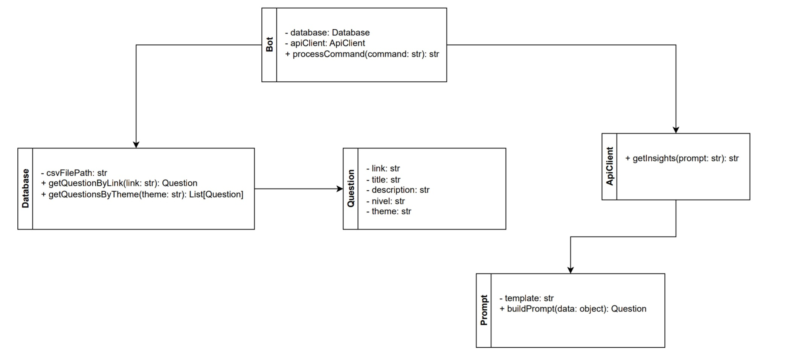

# PI-II - Bot Discord para Estudos da OBI

Este projeto visa fornecer suporte a alunos de escolas de Crateús, Russas e região, utilizando o Discord como plataforma para os estudos da Olimpíada Brasileira de Informática (OBI).

## 🎯 Objetivo

Desenvolver um bot para o Discord utilizando a biblioteca [discord.js](https://discord.js.org/) para fornecer interações automatizadas. O bot irá se integrar à API Gemini para gerar insights sobre questões da OBI e permitirá aos usuários buscar questões por tema, otimizando o processo de preparação para a competição.

---

## 🏗️ Arquitetura

A aplicação segue o padrão **MVC** (Model-View-Controller) com o objetivo de separar claramente as responsabilidades do sistema e facilitar a manutenção e escalabilidade.

### **Camada de View/Interface:**
- Responsável pela interação com o usuário através de comandos e respostas no Discord.
- Implementada utilizando a biblioteca [discord.js](https://discord.js.org/), que fornece as ferramentas necessárias para criar e gerenciar bots interativos no Discord.

### **Camada de Controller:**
- Contém a lógica de negócios para processar os comandos do usuário.
- Utiliza [discord.js](https://discord.js.org/) para integrar a interação do usuário com a lógica de execução do bot.

### **Camada de Model:**
- Gerencia a lógica de dados e interage diretamente com a base de dados (neste caso, um arquivo CSV).
- Utiliza a biblioteca **csv-parser** para realizar a leitura e o processamento dos dados contidos no arquivo CSV, que armazena as questões e informações relacionadas à OBI.

### **Camada de Serviços:**
- Responsável por interagir com serviços externos, como a **API Gemini**, para buscar insights relacionados às questões da OBI.
- Utiliza a biblioteca **[google/generative-ai](https://ai.google.dev/)** para realizar chamadas à API e obter sugestões de resolução de questões.

### **Base de Dados:**
- O sistema armazena as questões e informações relacionadas à OBI em um arquivo **CSV**, que é processado e manipulado pelas camadas do modelo e controller.

---

## 📋 Requisitos do Projeto

1. **Base de dados CSV:**
   - O sistema deve ser capaz de carregar e processar um arquivo CSV contendo questões da OBI.

2. **Integração com API Gemini:**
   - O bot deve ser capaz de enviar dados sobre uma questão para a API Gemini e receber dicas e insights sobre a resolução da questão.

3. **Comando para buscar insights sobre questões:**  
   - O usuário deve enviar um **link de uma questão** do site da OBI para o bot.
   - O bot deve buscar a questão correspondente na base de dados e consultar a **API Gemini** para retornar dicas e insights sobre a questão.

4. **Comando para buscar questões por tema:**  
   - O bot deve permitir que o usuário envie um **tema** e retorne uma lista de questões relacionadas a esse tema a partir dos dados armazenados no arquivo CSV.

---

## 🛠️ Tecnologias e Bibliotecas Utilizadas

- **[ Discord.js](https://discord.js.org/):** Biblioteca Node.js para criar bots no Discord.  
- **[ Node.js](https://nodejs.org/):** Ambiente de execução JavaScript no lado do servidor.  
- **[ csv-parser](https://www.npmjs.com/package/csv-parser):** Biblioteca para ler e processar arquivos CSV, utilizada para acessar dados das questões da OBI.  
- **[ generative-ai](https://ai.google.dev/):** Biblioteca para integração com a API Gemini, utilizada para gerar insights sobre as questões da OBI.

---

## 📜 Funcionalidades

### 1. **Buscar insights sobre questões específicas**
- **Objetivo:** O bot deve ser capaz de fornecer insights e dicas sobre questões específicas da OBI.
- **Processo:**
  - O usuário envia um **link de uma questão** por meio do comando slash (`/`) no Discord.
  - O bot localiza a questão correspondente na base de dados (arquivo CSV).
  - O bot faz uma consulta à **API Gemini**, que retorna **insights** e **dicas** sobre como resolver a questão.

### 2. **Buscar questões por tema**
- **Objetivo:** O bot deve permitir a busca por questões relacionadas a um tema específico.
- **Processo:**
  - O usuário envia um **tema** via comando slash (`/`).
  - O bot consulta a base de dados (arquivo CSV) e retorna uma lista de questões relacionadas ao tema especificado.

---

## 🗄️ Diagrama de Classes 

---
